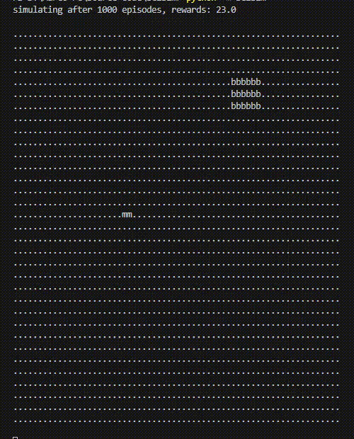

# SC2Sim - A StarCraft II Simulation Environment

## About
This project is a StartCraft II simulation environment to play the *Move to Beacon*
sub game. As running a full StartCraft II game instance introduces a lot of simulation
overhead, this project aims at reducing the overhead entirely by replacing the game
with a much simpler but similar environment specifically designed for RL trainings.

## Quickstart
Downlaod the source code.

```sh
git clone https://github.com/Bonifatius94/sc2sim
cd sc2sim
```

Launch the RL training with the default QLAgent.

```sh
python -m sc2sim
```

The simulation should look like following example where
the marine (agent) has to move towards the beacon to collect it.



## Usage
Following example outlines the suggested usage of the package.
Feel free to replace the QLAgent with your agent / training algorithm.

```py
from sc2sim.sc2_environment import SC2Env
from sc2sim.sc2_ql_agent import QLAgent
from sc2sim.sc2_runner import SC2GameSession

def main():
    env = SC2Env()
    agent = QLAgent()
    runner = SC2GameSession(env, agent, 20000, 1000)
    runner.run()
```

*Note: The simulation environment needs to be reset on initial creation.
Otherwise the marine spawns already at the beacon.*

## Containerized Trainings
All build + test scripting is abstracted by a Dockerfile running
a training session in the entrypoint of the container.
The containerized training session is configured and launched
using Docker-Compose.

```sh
docker-compose up
```

## License
This software is available under the MIT licence's terms.
